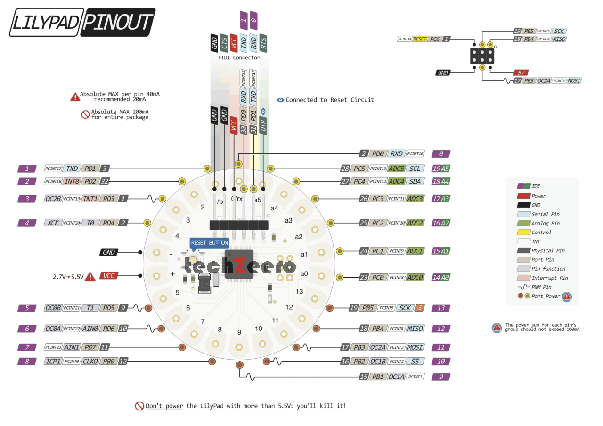

## Hardware Used
* Lilypad Arduino 328P
* CP2102 USB to TTL Module
* Wire

## Pinout for LiyPad 328P


## Upload to mini pro without DTR pin
Connect it as usually:
```
LilyPad     <->     CP2102
GND         <->     GND
RX          <->     TX
TX          <->     RX
VCC         <->     5V or 3.3V
```

When programming from Arduino IDE, press and hold the Reset button during compilation and release it after information about sketch size appears and state changes to "Uploading". Uploading should begin and succeed.

## Board selection
    Click [Tools] > [Board: "XXXXX"] > [Arduino/Genuino Uno].